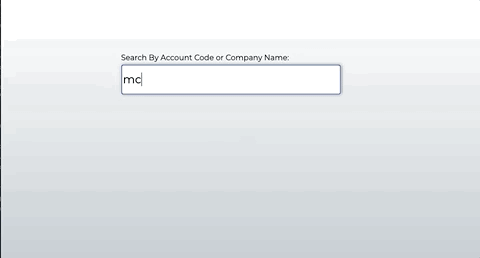

# Zendesk Custom Search

## Usage

This app allows users to search for specific fields on Organization Profile in Zendesk by using the Zendesk API and then it will render the Open tickets that Organization has. The results table displays custom fields for this instance of Zendesk Support. This app can be easily modified for your specific need by changing the params and updating the table to display the custom fields of your Zendesk Instance.

## Tech Stack

- Html/CSS
- Axios
- Vanilla JS
