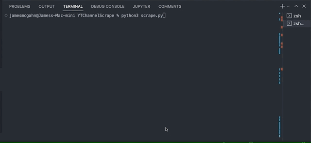

# Youtube Channel Scraper

## Usage

Allows you to scrape all of the video titles, links, and lengths of the video from a youtube channel's video page. It saves the data as a .csv file.

Because YouTube uses continuous scroll, Selenium is necessary to automate the browsing of the page. Using the source file from Selenium, BeautifulSoup scrapes the data from the html source file and then it gets written to a .csv file.

This scraper works with both named channels and unnamed youtube channels.
- https://www.youtube.com/c/{channel_name}/videos
- https://www.youtube.com/channel/{channel_name}/videos

## Tech Stack

- Python
- Selenium
- BeautifulSoup