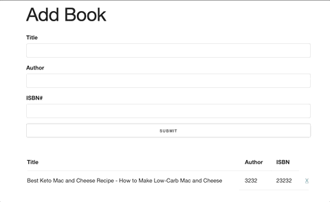

# Book List Project

Book List Project was one of the Projects in Brad Traversy - Modern JavaScript From The Beginning
The goal of the project was to use OOP in es5 and then refactor the code to ES6.
index.js (ES5), indexES6.js (ES6)

## Link

https://zen-rosalind-7b1d47.netlify.app/

## Usage

Users can enter a book by inputting the Title, Author and ISBN. If users fail to input one of the three fields an alert message displays. The alert will also display when a user succesfully adds an item. The item is store in a table below the form. A user can delete an item from the table by clicking that specific line item's "X." An alert will display on a successfully deleted item. Local storage is used for this app to save and remember books.

## Tech Stack

- Html
- CSS
- Skeleton
- Javascript
