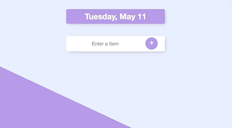

# Todo App (2) Project

The Todo App (2) was a Project in Angela Yu's - The Complete 2021 Web Development Bootcamp. The goal of this project was to create a full stack app with mongodb.

App slightly modified from the tutorial (added asyncs for the db calls, updated syntax here and there, different choice of methods).

## Link

https://tranquil-brushlands-43602.herokuapp.com/

## Usage

In this simple Todo app, Users can create todos by simply entering an item and clicking enter. If they are against using keyboards to submit items, they can always just click the big plus sign to add their item. If users want to delete a completed todo, all they need to do is check the checkbox next to the todo and presto, the todo will be no more.

## Tech Stack

- Html
- CSS
- JavaScript
- MongoDb
- Node.js
- Express
