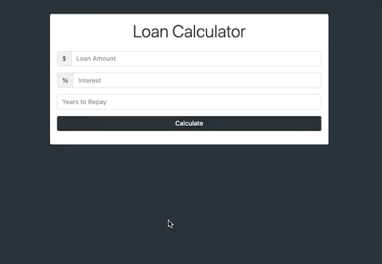

# Loan Calculator Project

TaskList Project was one of the Projects in Brad Traversy - Modern JavaScript From The Beginning

## Link

https://dazzling-morse-ff3920.netlify.app/

## Usage

Users can enter a loan amount, interest and Years to repay. The loan calculator will display results in the form of the Monthly Payment, Total Payment and Total Interest for the inputted Load.

## Tech Stack

- Html
- css
- bootstrap
- Javascript
