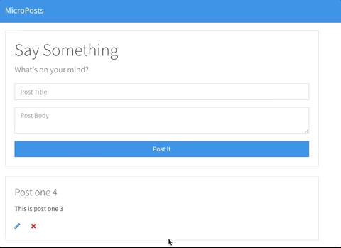

# MicroPost Project

Final Project in Brad Traversy - Modern JavaScript From The Beginning
The goal of the project was to make a CRUD application (mimicing a real rest api application) using db.json.

## Usage

Users submit a "micro post" and it will post to the database and update onscreen. Users can delete or edit a specific post by clicking the delete or edit icons. If the edit icon is clicked, the form will turn to an "edit state." The specific post that was selected will populate in the form so they user can make an adjustment. If the user changes their mind they can click cancel and return back to the "add state"

## Tech Stack

- Html
- CSS
- Bootstrap
- Javascript
- Babel
- Webpack
- db.json
