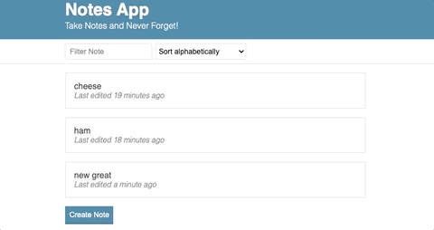

# Note Taker Project

Note Taker project was one of the Projects in Andrew Mead's - The Modern JavaScript Bootcamp

## Link

https://pensive-golick-9f57dd.netlify.app/

## Usage

The main page will display notes that are created by users. Users can filter notes by text inputed or they can sort them by last edited, recently created or alphabetically. When users create a new Note they will be taken to an edit page where they can input a title and a body for the note. Users can also edit notes by clicking on them on the main page. Notes are stored in the users local storage.

## Tech Stack

- Html/CSS/
- Javascript

### Packages Used

- Moment.js
- uuid
