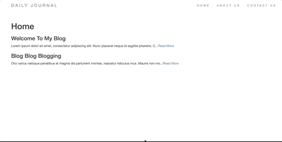

# Personal Blog Project

The Personal Blog was a Challenge Project in Angela Yu's - The Complete 2021 Web Development Bootcamp. The goal of this project was to create a full stack app with mongodb.

## Link

https://enigmatic-lowlands-24557.herokuapp.com/

## Usage

In this simple Personal Blog app, Users can have their very own blog site. The Home page will display all of their blog posts. It will display the title and body of the blog post. If the body is more than 100 characters, it will only display the first 100 characters of the body. Readers can click "read more" and it will take them to the show page of that specific blog post. Users can post their own blog posts at a "secret" page (/compose) and the post will show up on the home page.

## Tech Stack

- Html
- CSS
- JavaScript
- MongoDb
- Node.js
- Express
