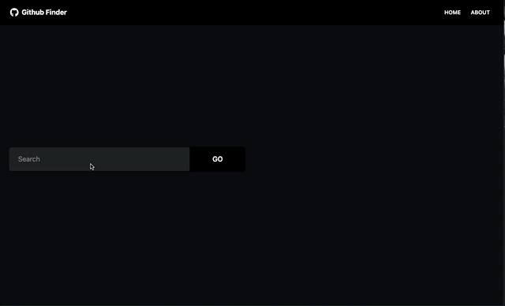

# Github Finder Project

The Github Finder Project was a Project in Brad Traversy's React Front to Back 2022. The goal of this project was to learn React and create an React App

## Link

https://transcendent-swan-fc61f2.netlify.app/

## Usage

In this app, users can search for github users based on their username. The app will display the search results. Users can then click into the username's profile to view stats about the user and their repos. Users can return home from the detail page and click into any of the other usernames displayed from the search results. Users can clear search results.

## Tech Stack

- Tailwind
- DaisyUI
- React
