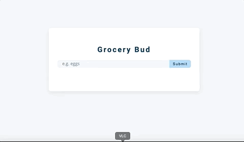

# Grocery Bud Project

Grocery Bud project was one of the Projects in John Smilga - Javascript Tutorial and Projects Course. Goal was using DOM manipulation. (Project is modified from tutorial. Project functions as tut does but was written without coding along with tut. Different choices of functions and handling of events were made compared to tut's choices)

## Link

https://zen-jepsen-2bc95d.netlify.app/

## Usage

Grocery Bud is basically a simple todo list where users can enter grocery items. Users can add list items by inputting text and then clicking submit or hitting enter. Each item can be editted or deleted. If a user wants to edit and item they can click on the pen and it will display that item in the input field to edit. When they are satisfied with their edit they can click submit. If a user wants to delete an item, they can click the trash can next to the item. The item will be removed from the list. If users want to clear the whole list they can click clear items and the app will clear out all their items from the list. List items are stored in the users local storage.

## Tech Stack

- Html/CSS
- Javascript
